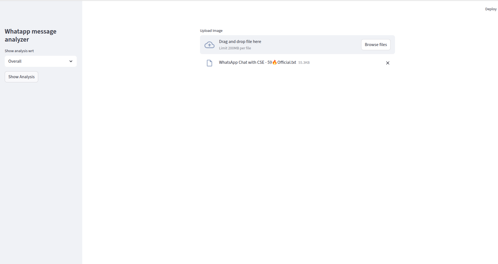
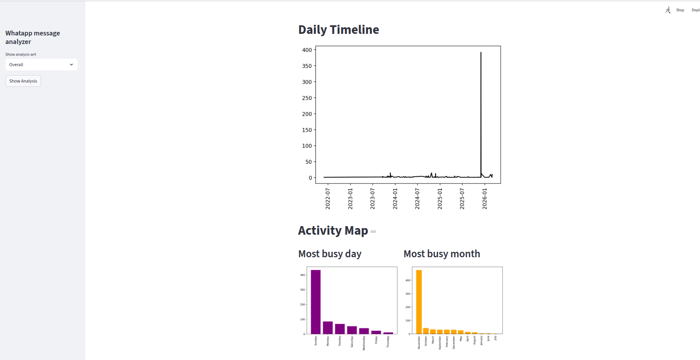
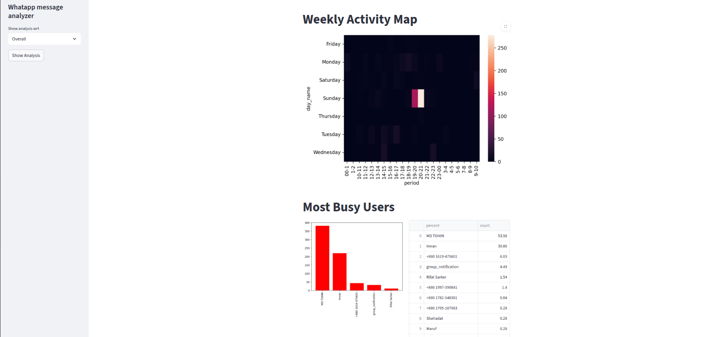
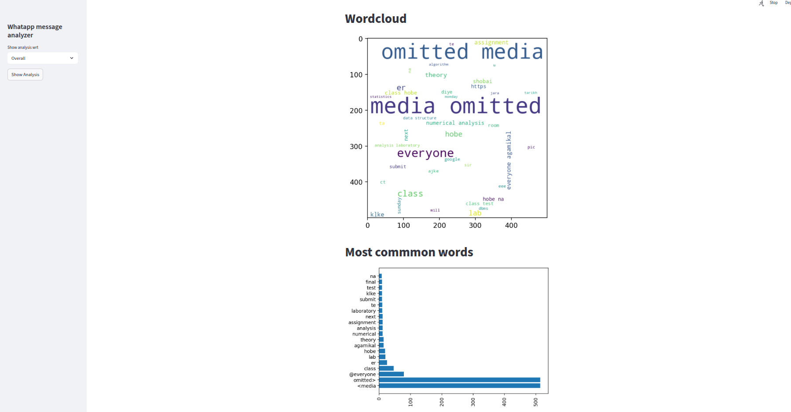
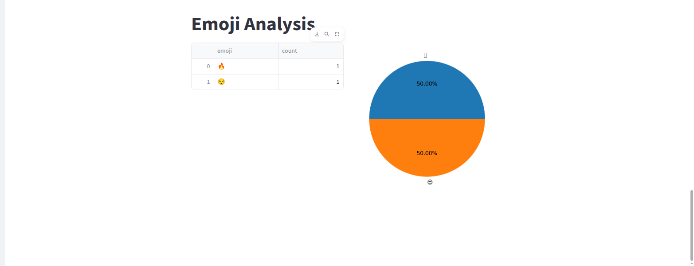

# 📊 WhatsApp Message Analysis

A Streamlit-based web application that analyzes WhatsApp chat data and provides meaningful insights such as message statistics, activity timelines, word frequency, emoji usage, and visualizations.

---

## 🚀 Features

* 📈 Total messages, words, media, and links statistics
* 👥 Most active users analysis
* ☁️ WordCloud generation
* 🔥 Most common words
* 😀 Emoji usage analysis
* 📅 Monthly and daily activity timeline
* 🗓 Weekly and monthly activity maps
* 🌡 Activity heatmap visualization

---

## 🛠 Tech Stack

* Python
* Streamlit
* Pandas
* Matplotlib
* WordCloud
* Emoji
* URLExtract
* NLTK

---

## 📂 Project Structure

```
Whatsapp-Message-Analysis/
│
├── app.py
├── helper.py
├── requirements.txt
├── data/
│   └── stop_hinglish.txt (optional)
└── README.md
```

---

## ⚙️ Installation

### 1️⃣ Clone the repository

```
git clone https://github.com/your-username/Whatsapp-Message-Analysis.git
cd Whatsapp-Message-Analysis
```

### 2️⃣ Create virtual environment

```
python -m venv venv
source venv/bin/activate      # Linux / Mac
venv\Scripts\activate         # Windows
```

### 3️⃣ Install dependencies

```
pip install -r requirements.txt
```

---

## ▶️ Run the Application

```
streamlit run app.py
```

The app will open in your browser.

---

## 📊 Screenshots


### 🏠 Dashboard Overview

Add your image like this:

```

```

Example:



---


### Top Statistics Graph

```

```


---
### ☁️ Activity Map and Time Line

```

```




---

### ☁️ WordCloud

```

```


---

### 😀 Emoji Analysis

```

```


---


## 📥 How To Export WhatsApp Chat

1. Open WhatsApp
2. Go to the chat
3. Click **Export Chat**
4. Choose **Without Media**
5. Upload the `.txt` file in the app

---

## 💡 Future Improvements

* Sentiment analysis
* Chat prediction
* Topic modeling
* Dark mode UI
* Deployment on Streamlit Cloud

---

## 📌 Author

Rifat Sarker

---

## 📄 License

This project is for educational purposes.
